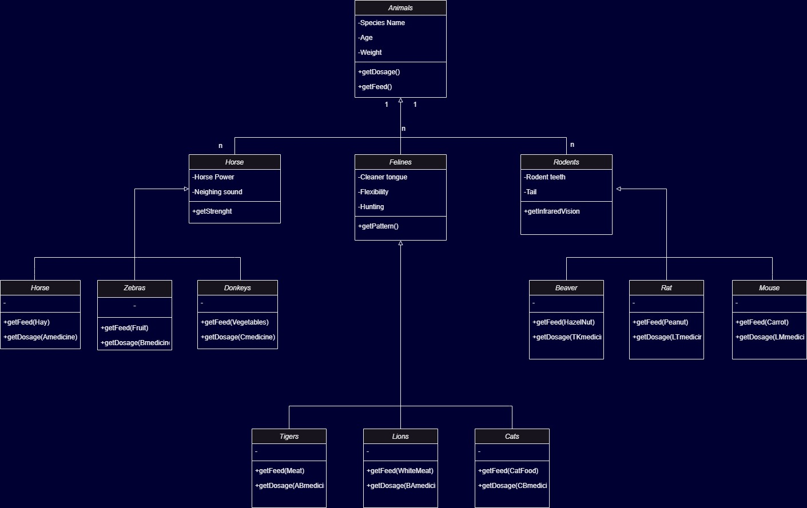

>***Hayvanat Bahçesi Class Diagram***
>Hayvanlar Hakkında Bilgileri Takip Etmek İçin Bir Sistem Tasarlıyoruz.
---
>***Hayvanlar:***
->Atlar (atlar, zebralar, eşekler vb.)
->Kedigiller (kaplanlar, aslanlar vb.),
->Kemirgenler (sıçanlar, kunduzlar vb.) gibi gruplardaki türlerle karakterize edilir.
->Hayvanlar hakkında depolanan bilgilerin çoğu tüm gruplamalar için aynıdır.
tür adı, ağırlığı, yaşı vb.
->Sistem ayrıca her hayvan için belirli ilaçların dozajını alabilmeli.
->Sistem Yem verme zamanlarını hesaplayabilmelidir.
---
>***Sistemin;*** 
Bu işlevleri yerine getirme mantığı, her gruplama için farklı olacaktır. ***Örneğin, atlar için yem verme algoritması farklı olup, kaplanlar için farklı olacaktır.Polimorfizm*** modeli kullanılacaktır.
---
---
>***Zoo Class Diagram***
>We are designing a system to track information about animals.
---
>******Animals:***
->Animals (horses, zebras, donkeys, etc.)
-> Felines (tigers, lions, etc.),
->Red rodents (rats, beavers, etc.) are characterized by species in such groups.
->Most of the information stored about animals is the same for all groupings.
species name, weight, age, etc.
->The system should also be able to retrieve the dosage of specific drugs for each animal.
->The system should be able to calculate feeding times.
---
>***System's;*** 
The logic for performing these functions will be different for each grouping. ***For example, the feeding algorithm will be different for horses and different for tigers. Polymorphism*** model will be used.
---
---

---